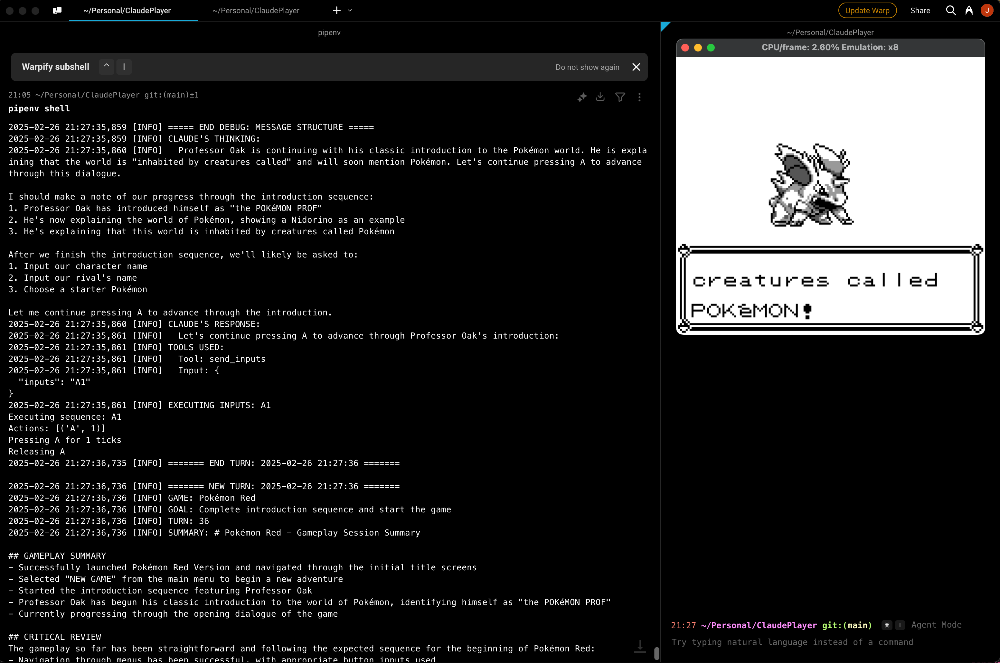

# Claude Player

An AI-powered game playing agent using Claude and PyBoy



[](https://www.python.org/downloads/release/python-31012/)
[](https://github.com/Baekalfen/PyBoy)
[](https://anthropic.com/claude)

## Overview

Claude Player is an AI agent that lets Claude play Game Boy games through the PyBoy emulator. The agent observes game frames, makes strategic decisions, and controls the emulator through button inputs.

I have been working on this project for a while, and have been meaning to clean it up and release it, and with the release of Claude 3.7 (especially given their semi official https://www.twitch.tv/claudeplayspokemon stream of a similar project), I thought it was a good time to do so.

I've taken some imspiration from their official implementation by adding additional memory tools and summarisation, however mine differs in that I don't have any coordinate based movement helpers: it is purely button based. Additionally, the emulator only ticks when the AI sends inputs, so it is not running at real time speed. 

## Features

- **AI-Powered Gameplay**: Uses Claude 3.7 to analyze game frames and determine optimal actions
- **Dual Emulation Modes**:
  - **Turn-based**: Emulator only advances when AI sends inputs (default)
  - **Continuous**: Real-time gameplay with periodic AI analysis
- **Memory System**: Short-term and long-term memory to maintain game context
- **Automatic Summarization**: Periodically generates game progress summaries
- **Tool-Based Control**: Structured tools for game interaction and state management
- **Screenshot Capture**: Automatically saves frames for analysis and debugging

## Requirements

- Python 3.10+
- PyBoy emulator
- Anthropic API key
- Game Boy ROM files
- Optional: Saved state files

## Installation

1. Clone the repository:
   ```
   git clone https://github.com/jmurth1234/claude-player.git
   cd claude-player
   ```

2. Install dependencies using Pipenv (recommended):
   ```
   pipenv install
   ```
   
3. Create a `.env` file with your Anthropic API key:
   ```
   ANTHROPIC_API_KEY=your_api_key_here
   ```

4. Place your Game Boy ROM file in the project directory

## Configuration

Configuration is loaded from `config.json` (created automatically on first run if not found). The settings are structured to avoid duplication between different modes. You can customize Claude's behavior by adding custom instructions that will be injected into the system prompt.

```json
{
  "ROM_PATH": "gold.gbc",            // Path to the Game Boy ROM file
  "STATE_PATH": "gold.gbc.state",    // Optional path to a saved state (null for none)
  "LOG_FILE": "game_agent.log",      // Path to the log file
  "EMULATION_MODE": "turn_based",    // "turn_based" or "continuous"
  "EMULATION_SPEED": 1,              // Emulation speed multiplier
  "CONTINUOUS_ANALYSIS_INTERVAL": 1.0, // Analysis frequency in seconds (continuous mode)
  "ENABLE_WRAPPER": false,           // Whether to enable the PyBoy game wrapper
  "ENABLE_SOUND": false,             // Whether to enable sound (continuous mode only)
  "MAX_HISTORY_MESSAGES": 30,        // Max messages kept in context window
  "CUSTOM_INSTRUCTIONS": "",         // Custom instructions injected into Claude's system prompt
  
  // Default settings for all model modes - inherited by ACTION and SUMMARY if not overridden
  "MODEL_DEFAULTS": {
    "MODEL": "claude-3-7-sonnet-20250219", // Claude model version
    "THINKING": true,                // Whether to enable Claude's thinking mode
    "EFFICIENT_TOOLS": true,         // Whether to use token-efficient-tools beta
    "MAX_TOKENS": 20000,             // Maximum tokens for Claude's response
    "THINKING_BUDGET": 16000         // Maximum tokens for Claude's thinking
  },
  
  // Action mode settings (inherits from MODEL_DEFAULTS)
  "ACTION": {
    // Override MODEL_DEFAULTS settings here if needed
  },
  
  // Summary mode settings (inherits from MODEL_DEFAULTS)
  "SUMMARY": {
    "INITIAL_SUMMARY": false,        // Generate a summary on first turn
    "SUMMARY_INTERVAL": 30           // Generate summary every N turns
    // Other MODEL_DEFAULTS can be overridden here
  }
}
```

You can customize these settings by:
1. Editing the generated `config.json` file directly
2. Creating your own configuration file and specifying it with:
   ```
   python play.py --config my_config.json
   ```

## Usage

1. Activate the Pipenv environment:
   ```
   pipenv shell
   ```

2. Run the agent:
   ```
   python play.py
   ```

   Or specify a custom configuration file:
   ```
   python play.py --config my_config.json
   ```

3. For setting up a saved state, you can use the included utility script:
   ```
   python emu_setup.py
   ```
   This script runs the emulator to help you create a saved state that you can reference in your configuration.

## Game Controls

The agent uses a structured notation for game inputs:

- **Single Press**: `A` (press A once)
- **Hold**: `A2` (hold A for 2 ticks)
- **Simultaneous**: `AB` (press A and B together)
- **Wait**: `W` or `W2` (wait for 1 or 2 ticks)
- **Sequence**: `R2 A U3` (right for 2 ticks, A once, up for 3 ticks)

Available buttons: `U` (Up), `D` (Down), `L` (Left), `R` (Right), `A`, `B`, `S` (Start), `X` (Select), `W` (Wait)

## Tool System

The AI uses several tools to interact with the game:

- `send_inputs`: Send button sequences
- `set_game`: Identify the current game
- `set_current_goal`: Set the current gameplay objective
- `add_to_memory`: Store important information
- `remove_from_memory`: Remove outdated information
- `update_memory_item`: Update existing memory items

## Debugging

- Game frames are saved to `./frames/{timestamp}/`
- Detailed logs are written to `game_agent.log`

## Contributing

Contributions welcome! Please feel free to submit a Pull Request.

## License

[MIT License](LICENSE)

## Acknowledgments

- Anthropic for the Claude AI model
- PyBoy developers for the Game Boy emulator